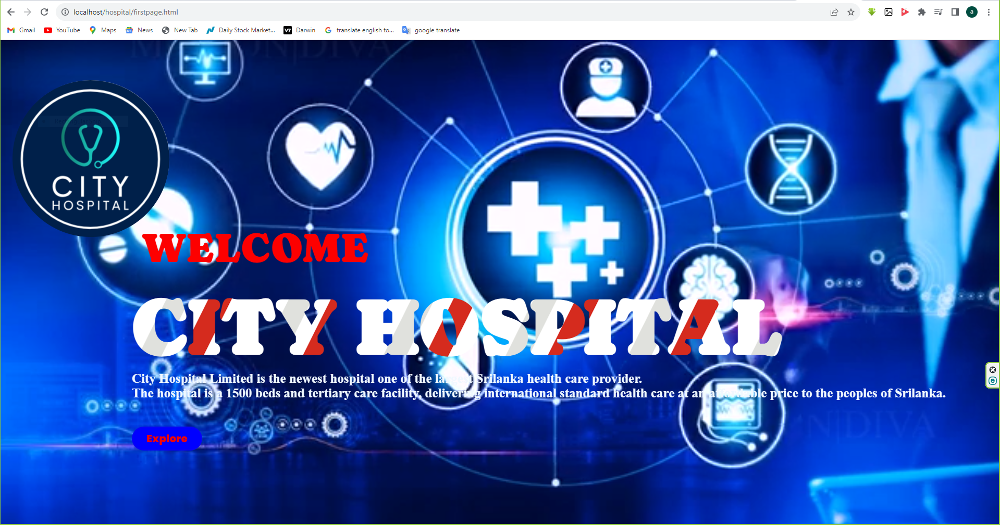
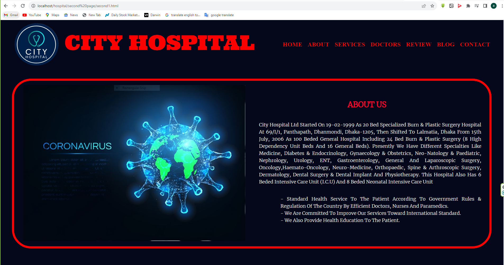
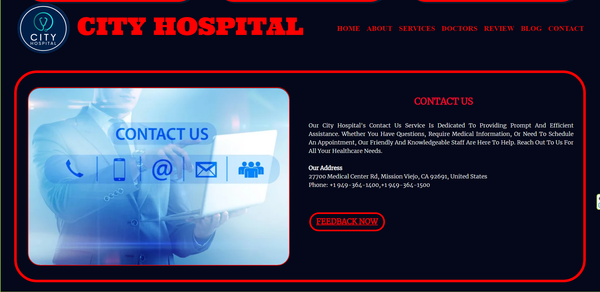

<h1>Hospital-Management-System-Website(Visual-Studio Code)</h1>
<h4>using html,PHP and CSS and MySql Database</h4>

<h2>Introduction this Hospital-Management-System-Website project</h2>
The Hospital Management System Website project is a comprehensive and efficient solution designed to streamline and improve the management of healthcare facilities. This web-based system aims to facilitate the seamless operation of hospitals, clinics, and medical institutions by providing a user-friendly platform for both healthcare providers and patients. It leverages technology to enhance patient care, optimize administrative processes, and ensure the smooth functioning of healthcare facilities.
<ol>
<li><h4>User Roles and Authentication:</h4></li>
<ul>
<li>The system supports different user roles, including administrators, doctors, nurses, patients, and receptionists.</li>
<li>Each user has a unique login with role-based access control to ensure data security and privacy.</li>
</ul>
<li><h4>Appointment Scheduling:</h4></li>
<ul>
<li>Patients can schedule appointments with doctors based on their availability.</li>
<li>Doctors can view their appointment schedules and make necessary adjustments.</li>
</ul>
<li><h4>Patient Records Management:</h4></li>
<ul>
<li>Doctors and nurses can create and manage electronic health records (EHRs) for patients, including medical history, prescriptions, test results, and treatment plans.</li>
<li>Patients can access their own health records securely.</li>
</ul>
<li><h4>Billing and Invoicing:</h4></li>
<ul>
<li>The system automates billing processes, generating invoices for services rendered.</li>
<li>Patients can view and pay bills online.</li>
</ul>
<li><h4>Laboratory Integration:</h4></li>
<ul>
<li>Integration with laboratory systems for test requests, results, and reporting.</li>
<li>Doctors can order tests and receive results electronically.</li>
</ul>
<li><h4>Inventory and Equipment Management:</h4></li>
<ul>
<li>Hospital staff can monitor and manage inventory levels for medical supplies and equipment.</li>
<li>Automated alerts for low stock or equipment maintenance.</li>
</ul>
<li><h4>Reporting and Analytics:</h4></li>
<ul>
<li>Generate reports on patient demographics, financial data, and operational performance.</li>
<li>Use analytics to identify trends and make informed decisions.</li>
</ul>
<li><h4>Emergency Services:</h4></li>
<ul>
<li>Integration with emergency services for rapid response and patient admissions in critical situations.</li>
</ul>
<li><h4>Feedback and Surveys:</h4></li>
<ul>
<li>Collect patient feedback and satisfaction surveys to improve the quality of care.</li>
</ul>

<h2>Project GUI</h2>

